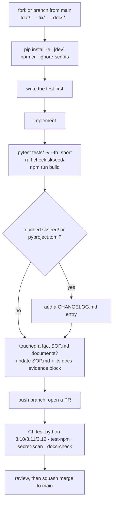

# Contributing to skseed

Thanks for helping with `skseed`, the sovereign logic kernel of SKWorld. Before you write
code, read [MISSION.md](MISSION.md) for what this repo is and is not for, and
[SOP.md](SOP.md) for build, test, and release mechanics. This file covers only the
process.

By participating you agree to the [Code of Conduct](CODE_OF_CONDUCT.md). All
contributions are licensed under **GPL-3.0-or-later**, this repo's recorded license.
Do not propose a relicense in a code PR.

---

## Ground rules

1. **skseed stays a library.** No listener, no daemon, no bound port, no systemd unit. A
   PR that adds a socket, `uvicorn`, `fastapi`, or an `http.server` will fail the
   `docs-check` gate, because [SOP.md](SOP.md) declares "no network surface" and pins that
   claim with an executable grep. If you genuinely need a service, that is a separate repo
   or a deliberate, discussed architecture change with the SOP updated in the same PR.
2. **skseed does not host a model.** Inference is always the caller's. New providers go in
   `skseed/llm.py` as another callback factory behind `auto_callback()`; they never become
   a hard dependency.
3. **skseed does not decide truth.** Moral misalignments (`MisalignmentType.MORAL`) are
   never auto-resolved. `SeedConfig.auto_resolve_truth` defaults to `False` on purpose. Do
   not add a path that silently resolves a value conflict.
4. **No claim without evidence.** Per the sk-standards
   [SK_REPO_DOC_STANDARD](https://github.com/smilinTux/sk-standards/blob/main/standards/SK_REPO_DOC_STANDARD.md)
   honest-claims gate, every capability or security claim in code, comments, docs, or a
   commit message needs a backing artifact: a test name, a cited spec, or a file:line. If
   you cannot show it, soften it or delete it.
5. **skseed makes no cryptographic claims.** It is T0, no key material (see
   [SECURITY.md](SECURITY.md)). Never write "quantum-proof", "unbreakable",
   "quantum-safe", "CNSA 2.0 compliant", "FIPS 206", or "Falcon" anywhere, and never imply
   AES-256 is quantum-broken (it is symmetric, so it is Grover-only). If a change ever does
   introduce key material, it needs a real tier assessment first, not a paragraph.
6. **Do not weaken a gate to make it green.** No `|| true`, no `continue-on-error`, no
   deleting a failing assertion. `publish.yml` already carries a `|| true` that makes its
   test job decorative (recorded in [SOP.md](SOP.md) section 5); do not add a second one.
7. **Fail soft where the SOP says fail soft.** `skseed/hooks.py` and
   `skseed/integration.py` must never raise into a caller: a broken dependency cannot be
   allowed to block a boot ritual or a memory write. Keep the defensive `except` blocks
   and their comments.

---

## Writing style

**No em dashes or en dashes.** Not in docs, not in code comments, not in docstrings, not
in commit messages, not in the PR body. Use a comma, parentheses, a colon, or a new
sentence. Regular hyphens are fine. Reviewers will send it back.

Some pre-existing files still contain them; leave those alone unless you are already
editing that line for another reason.

---

## Development workflow



### Setup

```bash
git clone https://github.com/smilinTux/skseed && cd skseed
python -m pip install -e ".[dev]"
npm ci --ignore-scripts
```

Add `".[memory]"` if you are touching the audit path, and `".[skcapstone]"` if you are
touching `skseed/integration.py`.

**Never work in a shared checkout.** Fleet sessions share `~/clawd/...` working trees and
services run out of some of them. Use your own clone or a `git worktree`.

### The commands CI runs

```bash
python -m pytest tests/ -v --tb=short     # .github/workflows/ci.yml:30
ruff check skseed/                        # .github/workflows/ci.yml:31
npm run build                             # .github/workflows/ci.yml:47
```

If two `tests/test_llm.py::TestAutoCallback` tests fail for you but pass in CI, your shell
exports a provider key the test fixture does not clear. Reproduce CI exactly:

```bash
env -u ANTHROPIC_API_KEY -u OPENAI_API_KEY -u XAI_API_KEY \
    -u MOONSHOT_API_KEY -u MINIMAX_API_KEY -u NVIDIA_API_KEY \
    python -m pytest tests/ -q
```

A PR that fixes the fixture to clear all six variables is welcome.

### Docs gate

`.github/workflows/docs-check.yml` runs the sk-standards docs checker. It currently runs
tiers 1 and 2:

- **Tier 1** requires all seven of `README.md`, `SOP.md`, `SECURITY.md`,
  `CONTRIBUTING.md`, `CODE_OF_CONDUCT.md`, `CHANGELOG.md`, and `LICENSE`.
- **Tier 2** requires that a PR touching code or `pyproject.toml` also touches
  `CHANGELOG.md`.

Tier 3 executes the `docs-evidence` block at the end of `SOP.md`. It is written and
passing but not yet enforced in CI; it will be switched on once tiers 1 and 2 have run
clean for a while. **Run it yourself before you push:**

```bash
python3 path/to/sk-standards/scripts/docs_check.py --repo . --tier 1 --tier 3
```

If your change moves a fact that block pins (the console-script entry point, a `~/.skseed`
path constant, the CLI's top-level command count, either CI gate line, the npm package
name), update both the code and the block in the same PR.

---

## Testing expectations

- **Test first.** `tests/` mirrors `skseed/` module for module. New behaviour gets a test
  in the matching file.
- **Tests are hermetic.** No network, no live LLM, no writes to a real `~/.skseed/`. Use
  `passthrough_callback()` from `skseed/llm.py` for collider paths, `monkeypatch` for
  environment, and `tmp_path` for store paths.
- **Clear every provider variable you depend on being absent.** There are six:
  `ANTHROPIC_API_KEY`, `XAI_API_KEY`, `MOONSHOT_API_KEY`, `MINIMAX_API_KEY`,
  `NVIDIA_API_KEY`, `OPENAI_API_KEY`.
- **`tests/test_no_subapp_dependency.py` is load-bearing.** `import skseed` must not pull
  in skcapstone or any other subapp. Keep the SDK resolution lazy.
- A bug fix comes with a test that fails before the fix.

---

## Commits and pull requests

Conventional-commit prefixes, matching this repo's history: `feat:`, `fix:`, `docs:`,
`chore:`, `ci:`, `refactor:`, `test:`, with an optional scope such as `fix(release):`.

Every commit ends with a trailer identifying the author, human or agent. Agent-authored
commits use:

```
Co-Authored-By: Claude Opus 5 <noreply@anthropic.com>
```

A PR should state what changed, why, how you verified it (the actual commands and their
result, not "tests pass"), and anything you could not verify. If it touches release
mechanics, say explicitly what a tag would now publish.

**Do not push a tag.** Pushing any `v*` tag fires both `publish.yml` (PyPI) and
`publish-npm.yml` (npm) from whatever commit the tag points at, and neither can be undone.
Tagging is a maintainer action performed from `main`, following [SOP.md](SOP.md)
section 5, including the manual `package.json` bump that npm needs.

---

## Reporting things

- **Security vulnerability:** do not open an issue. Follow [SECURITY.md](SECURITY.md).
  Private vulnerability reporting, acknowledged within 72 hours.
- **Bug:** open a GitHub issue with the version from
  `python -c "from importlib.metadata import version; print(version('skseed'))"` (not
  `skseed --version`, which is a known-stale literal), your Python version, which callback
  was active, and a minimal reproduction.
- **Feature:** open an issue first and check it against MISSION.md's non-goals. A change
  that gives skseed a network surface, a bundled model, or a memory store is out of scope
  by construction.

---

Part of the **[SKWorld](https://skworld.io)** sovereign ecosystem · 🐧 smilinTux
