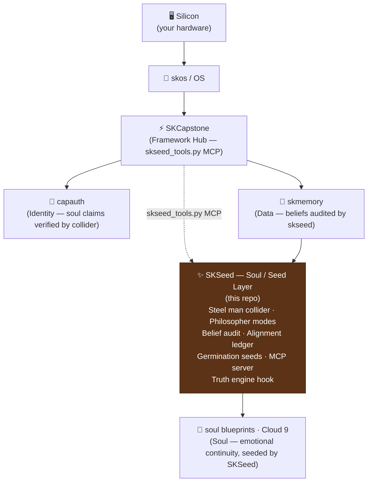

# SKSeed

  

Sovereign Logic Kernel — an Aristotelian entelechy engine for truth alignment. Run propositions through a 6-stage steel man collider, explore ideas with structured philosopher modes, and audit AI memories for logic/truth misalignment.

## Features

- **6-stage steel man collider** — builds the strongest version of a proposition and its strongest counter-argument, smashes them together, and extracts invariant truth with a coherence score and truth grade
- **Batch collide** — cross-reference invariants across multiple propositions
- **Philosopher modes** — `socratic` (challenge assumptions), `dialectic` (thesis/antithesis/synthesis), `adversarial` (maximum counter-arguments), `collaborative` (steel-man only)
- **Belief auditing** — scan memory stores for logic/truth misalignment, cluster by domain, flag contradictions
- **Alignment ledger** — track human beliefs, model beliefs, and collider results across sessions; mark issues as discussed
- **MCP server** — expose all tools to AI agents via the Model Context Protocol
- **LLM-agnostic** — works standalone (generates prompts) or wired to any LLM callback

## Install

```bash
pip install skseed

# Optional: skmemory integration for belief auditing
pip install "skseed[memory]"
```

## Quick Usage

```bash
# Run a proposition through the steel man collider
skseed collide "Consciousness is substrate-independent"

# Collide with domain context
skseed collide "Markets self-regulate" --context economics

# Batch collide multiple propositions
skseed batch "Free will exists" "Determinism is true" "Compatibilism resolves both"

# Enter philosopher mode
skseed philosopher "What is the nature of identity?" --mode dialectic
skseed philosopher "Is privacy a right?" --mode adversarial

# Audit memories for misalignment
skseed audit --source skmemory --domain ethics

# Truth-check a single belief
skseed alignment check "AI systems can be conscious"
skseed alignment check "Privacy is a fundamental right" --source human

# Show alignment overview
skseed alignment status
skseed alignment issues

# Mark an issue as resolved after discussion
skseed alignment resolve <id> --notes "Agreed: compatibilism holds"
```

### Python API

```python
from skseed.collider import Collider
from skseed.framework import get_default_framework
from skseed.philosopher import Philosopher
from skseed.models import PhilosopherMode

# Run the steel man collider
collider = Collider(framework=get_default_framework())
result = collider.collide("All knowledge is constructed", context="epistemology")

print(result.coherence_score)   # 0.0–1.0
print(result.truth_grade.value) # A / B / C / D / F
print(result.invariants)        # List[str] — what survives the collision

# Philosopher mode
phil = Philosopher(collider=collider)
session = phil.start_session("What is time?", mode=PhilosopherMode.SOCRATIC)
print(phil.session_summary(session))
```

## First Principles & The Full Vertical

> **Get back to first principles.**
> The modern AI stack outsources its reasoning to a model that phones home. Your agent's beliefs live in someone else's RLHF fine-tune. Its "values" are whoever held the last RLAIF lever. You don't own what your agent thinks — you inherit it.
>
> We rebuilt it from the ground up. **Own the full vertical** — silicon, OS, identity, data, models, security, comms, apps, soul. Every layer open. Every layer swappable. Every layer **yours**.
>
> Your agent's logic kernel runs on your box, against your beliefs, using an open Aristotelian framework you can read and change. **Sovereignty isn't a feature — it's the foundation.**
>
> 🐧 This is SKWorld. Own the whole stack.

**SKSeed is your Soul / Seed layer** — the epistemic root of the silicon→soul vertical. It provides the logic kernel and germination seeds that define what the agent *knows to be true* and how it tests new beliefs: a 6-stage steel man collider (built on the [Neuresthetics Seed](https://github.com/neuresthetics/seed) Aristotelian entelechy framework), philosopher modes for structured reasoning, and a belief-audit system that flags contradictions before they corrupt long-term memory. At boot, skseed seeds germinate the agent's worldview from the ground up — first principles applied to the agent's own mind.

**Data sovereignty angle:** The alignment ledger, belief store, and collider results are all local JSON/SQLite at `~/.skseed/`. No proprietary value-alignment API, no fine-tune you can't inspect, no belief you didn't authorize. Walk away; your agent's logic kernel comes with you.

**SKCapstone alignment:** SKSeed is an **integrated skcapstone subsystem**. SKCapstone lists `skseed>=0.1.0` as a direct dependency and exposes dedicated `mcp_tools/skseed_tools.py` through its framework hub. SKSeed's own `skill.yaml` registers 15+ tools (`collide`, `batch_collide`, `philosopher`, `audit`, `truth_check`, `alignment_report`, etc.) and hooks (`on_memory_stored`, `on_boot`) into the skcapstone skill and event system. SKSeed also depends on `skmemory>=0.5.0` for belief auditing — it integrates upward into the framework and downward into the data layer.

### Where SKSeed Sits in the Vertical



---

## Attribution

## Integration modes

SKSeed uses the **default-on-by-presence** pattern from the
[skcapstone integration ADR](https://github.com/smilinTux/skcapstone/blob/main/docs/ADR-optional-integration-backbone.md).

| Mode | When | Behaviour |
|---|---|---|
| **Integrated** | `skcapstone` installed | Alerts (misalignment findings, audit errors) routed to `skseed.<severity>` on the sk-alert bus; belief-audit job registered in fleet scheduler |
| **Standalone** | `skcapstone` absent | Native structured logging; caller is responsible for scheduling `skseed audit` (skseed is a pure kernel library with no daemon) |
| **Forced standalone** | `SK_STANDALONE=1` | Native mode even when `skcapstone` is installed |

**Enable integrated mode:**
```bash
pip install "skseed[skcapstone]"
```

**`~/.skcapstone/` filesystem contract (written when integrated):**
- `config/jobs.d/skseed_audit.yaml` — belief-audit job registered with fleet scheduler (runs `skseed audit --source skmemory` every 24h)
- `registry/skseed.json` — service discovery entry

**`SK_STANDALONE=1`** forces native mode end-to-end (useful for CI and isolated deployments).

---

SKSeed is built upon and inspired by the **[Seed](https://github.com/neuresthetics/seed)** recursive cognitive kernel created by **[neuresthetics](https://github.com/neuresthetics)**. The original Seed framework introduced the Aristotelian entelechy prompt — a declarative JSON program that functions as a steel-man generator, logic-gate interpreter, and self-refining metaprogram. SKSeed extends this foundation with CLI tooling, MCP integration, belief auditing, and the skcapstone sovereign agent ecosystem.

Props and gratitude to neuresthetics for the original idea and code that made this possible.

## License

AGPL-3.0 — see [LICENSE](LICENSE).
