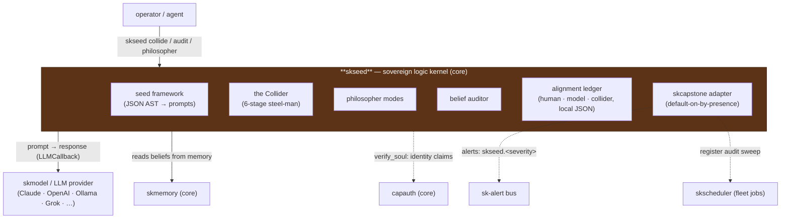

# skseed — the Sovereign Logic Kernel 🐧

  

> **Your agent's beliefs, tested against your truth — on your box, with a framework you can read and change.**
> An Aristotelian *entelechy* engine: run any proposition through a 6-stage steel-man
> collider, keep only what survives, and audit your agent's memory for the
> contradictions that corrupt long-term reasoning.

skseed is the **truth-alignment kernel** of the [SKWorld](https://skworld.io)
ecosystem. It takes a claim, builds its **strongest possible version** (steel-man),
collides it with its **strongest counter-argument** (inversion), and extracts the
**invariants** — what is irreducibly true across the collision. The same engine
powers belief auditing, identity verification, memory truth-scoring, and four
structured philosopher modes.

It is **LLM-agnostic by design**: the kernel generates prompts and accepts *any*
callback `(prompt: str) -> str`. With no model wired in, it emits the prompt for
you to run anywhere; with a callback (Claude, OpenAI, Ollama, Grok, Kimi, MiniMax,
NVIDIA NIM, or the Claude CLI) it executes end-to-end and parses the structured
result. Built on the open [Neuresthetics Seed](https://github.com/neuresthetics/seed)
framework.

## 60-second version

```bash
pip install skseed            # into the ~/.skenv venv

# Run a proposition through the 6-stage steel-man collider
skseed collide "Consciousness is substrate-independent" --context epistemology

# Cross-reference invariants across several propositions
skseed batch "Free will exists" "Determinism is true" "Compatibilism resolves both"

# Explore an idea in a structured mode (socratic | dialectic | adversarial | collaborative)
skseed philosopher "What is the nature of identity?" --mode dialectic

# Truth-check one belief and record it in the alignment ledger
skseed alignment check "Privacy is a fundamental right" --source human

# Audit your agent's memory for logic / truth misalignment
skseed audit --source skmemory --domain ethics

# See where alignment stands; review and resolve flagged issues
skseed alignment status
skseed alignment issues
skseed alignment resolve <id> --notes "Agreed: compatibilism holds"
```

Without an LLM callback, `collide` / `philosopher` print the **generated prompt** so
you can feed it to any model. Everything persists as local JSON under `~/.skseed/`.

## Quickstart

The kernel is model-agnostic. The CLI runs prompt-only by default; the Python API
lets you wire in any LLM:

```python
from skseed import Collider, Philosopher, Auditor, AlignmentStore
from skseed.framework import get_default_framework
from skseed.models import PhilosopherMode
from skseed.llm import auto_callback   # or anthropic_/openai_/ollama_callback

# 1. The collider — heart of skseed
collider = Collider(framework=get_default_framework(), llm=auto_callback())
result = collider.collide("All knowledge is constructed", context="epistemology")
print(result.coherence_score)    # 0.0–1.0
print(result.truth_grade.value)  # invariant / strong / partial / weak / collapsed
print(result.invariants)         # list[str] — what survived the collision

# 2. Philosopher mode wraps the collider with conversational engagement
phil = Philosopher(collider=collider)
session = phil.start_session("What is time?", mode=PhilosopherMode.SOCRATIC)
print(phil.session_summary(session))

# 3. The auditor extracts beliefs from memory, clusters by domain, collides each
store = AlignmentStore()                       # local JSON at ~/.skseed/alignment/
auditor = Auditor(collider=collider, alignment_store=store)
report = auditor.run_audit(memories=[...])     # list of memory dicts
print(report.summary())                        # aligned / misaligned / truth vs moral
```

`auto_callback()` probes in order: Claude Agent SDK → `ANTHROPIC_API_KEY` →
`XAI_API_KEY` → `MOONSHOT_API_KEY` → `MINIMAX_API_KEY` → `NVIDIA_API_KEY` →
`OPENAI_API_KEY` → a locally-running Ollama → `None`.

## What skseed provides

| Piece | What it is | Module |
|---|---|---|
| **The Collider** | the 6-stage steel-man engine: steel-man → inversion → collision (XOR) → reconstruction (NAND/NOR) → meta-recursion → invariant extraction (XNOR) | `collider.py` |
| **Seed framework** | the declarative reasoning kernel — JSON is the AST, the prompt is the program, the LLM is the runtime; loads `seed.json`, generates all collider/audit/philosopher prompts | `framework.py` |
| **Truth grades** | `invariant · strong · partial · weak · collapsed · ungraded` + a 0–1 coherence score | `models.py` |
| **Philosopher modes** | `socratic` (probing questions) · `dialectic` (thesis→antithesis→synthesis) · `adversarial` (maximum counter) · `collaborative` (steel-man only) | `philosopher.py` |
| **Belief audit** | scans a memory store, pattern-extracts belief-like content, clusters by domain, collides each cluster, separates **truth** vs **moral** misalignment (moral conflicts are *never* auto-resolved) | `audit.py` |
| **Alignment ledger** | three separate belief spaces — **human / model / collider** — persisted as local JSON, with a history ledger and an issues queue for discussion | `alignment.py` |
| **LLM callbacks** | ready-made adapters: Claude SDK, Anthropic, OpenAI (+ compatible), Ollama, Grok, Kimi, MiniMax, NVIDIA NIM, passthrough; plus `auto_callback()` | `llm.py` |
| **Skill entrypoints** | 14 dict-in/dict-out functions (`collide`, `batch_collide`, `philosopher`, `truth_check`, `audit`, `verify_soul`, `truth_score_memory`, `alignment_report`, …) exposed via `skill.yaml` | `skill.py` |
| **Event hooks** | `on_memory_check` (truth-check belief-like memories on store) and `on_boot_audit` (run the logic audit during the boot ritual) | `hooks.py` |
| **skcapstone adapter** | default-on-by-presence: routes alerts to `skseed.<severity>` on the sk-alert bus and registers the audit sweep with the fleet scheduler when skcapstone is installed | `integration.py` |

## Where it lives in SKStack v2

skseed is a **core** capability — the epistemic root of the stack. It is a pure
kernel **library** (no daemon): it has no inbound transport, no storage engine of its
own beyond local JSON, and no model of its own. It *uses* the LLM capability
(`skmodel` / external providers) as its runtime, reads beliefs out of `skmemory`,
verifies identity claims for `capauth`, and — when present — leans on the shared
platform primitives (sk-alert, the fleet scheduler) through one optional adapter.



Solid edges are real runtime dependencies; dotted edges are optional integrations
that degrade gracefully when the peer is absent (`SK_STANDALONE=1` forces native
mode). See **[docs/ARCHITECTURE.md](docs/ARCHITECTURE.md)** for the full collision
lifecycle, audit pipeline, alignment state machine, and source map.

## Integration modes

skseed uses the **default-on-by-presence** pattern from the
[skcapstone integration ADR](https://github.com/smilinTux/skcapstone/blob/main/docs/ADR-optional-integration-backbone.md).

| Mode | When | Behaviour |
|---|---|---|
| **Integrated** | `skcapstone` installed | Misalignment / audit-error alerts routed to `skseed.<severity>` on the sk-alert bus; the belief-audit sweep registered with the fleet scheduler |
| **Standalone** | `skcapstone` absent | Native structured logging; the caller schedules `skseed audit` (skseed is a pure kernel library with no daemon) |
| **Forced standalone** | `SK_STANDALONE=1` | Native mode even when `skcapstone` is installed (useful for CI / isolated deploys) |

```bash
pip install "skseed[skcapstone]"   # enable integrated mode
pip install "skseed[memory]"       # add skmemory for belief auditing
```

## First principles & the full vertical

> **Get back to first principles.**
> The modern AI stack outsources its reasoning to a model that phones home. Your
> agent's beliefs live in someone else's RLHF fine-tune; its "values" are whoever
> held the last RLAIF lever. You don't own what your agent thinks — you inherit it.
>
> skseed rebuilds it from the ground up. Your agent's logic kernel runs on **your**
> box, against **your** beliefs, using an open Aristotelian framework you can read
> and change. The alignment ledger, belief store, and collider results are all local
> JSON at `~/.skseed/` — no proprietary value-alignment API, no fine-tune you can't
> inspect, no belief you didn't authorize. Walk away; your agent's logic kernel comes
> with you.
>
> 🐧 This is SKWorld. Own the whole stack.

## Attribution

skseed is built upon the **[Seed](https://github.com/neuresthetics/seed)** recursive
cognitive kernel created by **[neuresthetics](https://github.com/neuresthetics)**.
The original Seed framework introduced the Aristotelian entelechy prompt — a
declarative JSON program that functions as a steel-man generator, logic-gate
interpreter, and self-refining metaprogram. skseed extends this foundation with CLI
tooling, the alignment ledger, belief auditing, LLM callbacks, and integration into
the SKWorld sovereign agent ecosystem. Props and gratitude to neuresthetics for the
original idea and code that made this possible.

## License

GPL-3.0-or-later — see [LICENSE](LICENSE).

---

Part of the **[SKWorld](https://skworld.io)** sovereign ecosystem · 🐧 smilinTux
