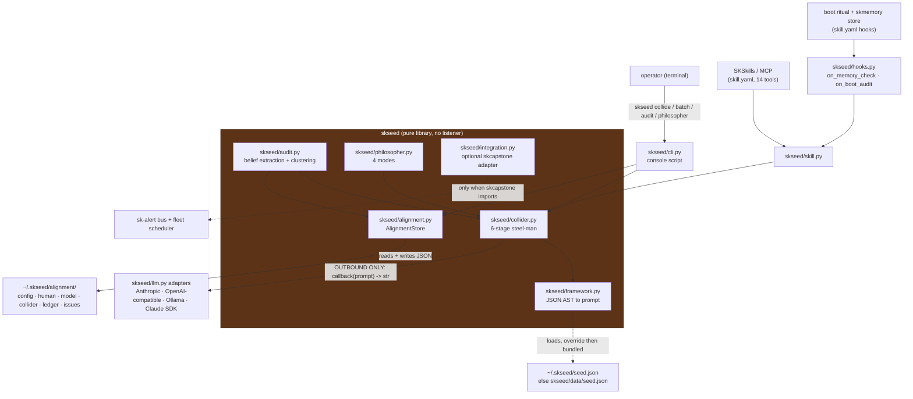
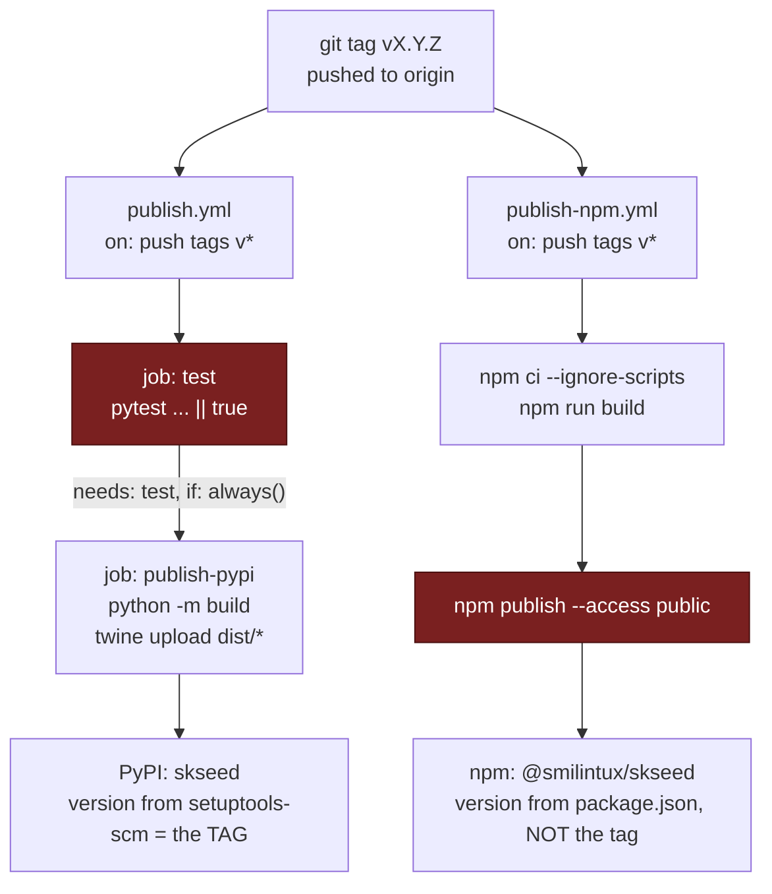

# skseed - Standard Operating Procedures

`skseed` is the sovereign logic kernel of SKWorld: a pure Python library plus a `skseed`
Click CLI that runs a proposition through a 6-stage steel-man collider and records what
survives in a local JSON alignment ledger. Its "protocol" is a prompt: the kernel builds
an LLM-ready prompt from a JSON seed framework and either returns it or executes it
through a caller-supplied `LLMCallback`. It is called by operators at a terminal, by the
SKSkills/MCP layer through `skill.yaml`, and by boot/memory hooks in `skseed/hooks.py`.

Background reading, not duplicated here: [MISSION.md](MISSION.md) (why it exists and its
non-goals), [docs/ARCHITECTURE.md](docs/ARCHITECTURE.md) (collision lifecycle, audit
pipeline, alignment state machine, module-by-module source map), [README.md](README.md)
(quickstart and the ecosystem picture), and [skill.yaml](skill.yaml) (the 14-tool
SKSkills manifest with input schemas).

---

## 1. Overview

### What it is

A dual-published library. The same repo ships:

| Artifact | Registry | Built from | Entry point |
|---|---|---|---|
| `skseed` | PyPI | `skseed/` (setuptools) | console script `skseed = "skseed.cli:main"` (pyproject.toml:50) |
| `@smilintux/skseed` | npm | `src/index.ts` compiled by `tsc` per tsconfig.json | `dist/index.js` / `dist/index.esm.js` / `dist/index.d.ts` (package.json) |

The two are not peers in scope. The Python package is the whole kernel (collider, audit,
alignment ledger, philosopher, LLM callbacks, CLI, skill entrypoints). The npm package is
a thin TypeScript surface: it re-exports the bundled `skseed/data/seed.json` framework
plus matching TypeScript types (`src/index.ts` imports `../skseed/data/seed.json`
directly). It does not reimplement the collider.

### What it owns

- The 6-stage collider primitive and its prompt generation from the seed JSON AST.
- Truth grading (`invariant` / `strong` / `partial` / `weak` / `collapsed` / `ungraded`)
  and the 0.0 to 1.0 coherence score (`skseed/models.py`).
- The three-space alignment ledger on local disk: human, model, collider beliefs, plus a
  history ledger and an issues queue (`skseed/alignment.py`).
- The belief-audit pipeline over memories handed to it (`skseed/audit.py`).
- The provider-callback adapter layer (`skseed/llm.py`).

### What it explicitly does NOT do

- **It does not run a daemon, listen on a port, or bind an address.** There is no socket,
  no `uvicorn`, no `fastapi`, no `http.server` anywhere under `skseed/`. See
  [section 5, Front-end / Exposure](#front-end--exposure). Note that
  `skseed/integration.py:212` passes a `~/.skseed/daemon.pid` path when registering the
  service with the skcapstone SDK, but nothing in this repo ever writes that file and no
  systemd unit exists on any fleet node. Treat the pid path as a placeholder in an
  optional adapter, not evidence of a daemon.
- **It does not host or bundle a model.** Inference is always the caller's; with no
  callback wired in, `collide` and `philosopher` print the generated prompt.
- **It does not store memories.** It audits memories that `skmemory` (or any caller)
  hands it.
- **It does not auto-resolve moral conflicts.** `MisalignmentType.MORAL` items are routed
  to a separate store for human plus AI discussion (`skseed/audit.py`).
- **It has no `status`, `doctor`, or `health` command.** See
  [section 7](#7-api--reference) for what the CLI actually exposes and section 8 for the
  closest substitutes.

---

## 2. Architecture

### Start here (entry-point files)

| File | What it is |
|---|---|
| `skseed/cli.py` | The `skseed` console script. Every top-level verb and group is declared here; `main()` at line 48 is the `[project.scripts]` target. |
| `skseed/collider.py` | The primitive everything else calls. `collide`, `batch_collide`, `cross_reference`, `verify_soul`, `truth_score_memory`, `audit_beliefs`, `philosopher`. |
| `skseed/framework.py` | Loads the seed JSON AST and turns it into every prompt variant. `DEFAULT_SEED_PATH = ~/.skseed/seed.json` (line 21), falling back to the bundled `skseed/data/seed.json`. |
| `skseed/skill.py` | The 14 dict-in / dict-out functions that `skill.yaml` names as tool entrypoints. This is the MCP/SKSkills surface. |
| `skseed/integration.py` | The only seam to the rest of the fleet. Default-on-by-presence: sk-alert routing and scheduler registration when `skcapstone` imports and `SK_STANDALONE` is unset. |

Secondary but load-bearing: `skseed/alignment.py` (all on-disk state,
`DEFAULT_ALIGNMENT_DIR = ~/.skseed/alignment` at line 35), `skseed/_ver.py` (version
resolution, read [section 9](#9-maturity-tier--version-reference) before touching it),
and `src/index.ts` (the entire npm surface).

### Call graph



Every arrow into the kernel is an in-process Python call. The only arrows leaving the
process are outbound HTTPS to an LLM provider (or `OLLAMA_HOST`, default
`http://localhost:11434`, `skseed/llm.py:202`) and file writes under `~/.skseed/`. There
is no inbound arrow, which is why section 5 declares no network surface.

The stage-by-stage collider mechanics, the audit pipeline, and the alignment state
machine are already drawn in
[docs/ARCHITECTURE.md](docs/ARCHITECTURE.md) sections 1 through 5; they are not repeated
here.

### On-disk layout

```
~/.skseed/
├── seed.json                     # optional framework override (skseed/framework.py:21)
├── daemon.pid                    # named by integration.py:212, written by nothing in this repo
└── alignment/                    # skseed/alignment.py:35
    ├── config.json               # SeedConfig
    ├── human/<id>.json           # human-stated beliefs (opt-in, off by default)
    ├── model/<id>.json           # model-held beliefs
    ├── collider/<id>.json        # collider-produced truths
    ├── ledger/<id>.json          # AlignmentRecord history
    └── issues/<belief>.json      # misalignments pending discussion
```

Nothing here is encrypted and nothing here is synced by skseed itself. It is plain local
JSON under the invoking user's home directory.

---

## 3. Build

Requires Python >= 3.10 (pyproject.toml:15). Runtime dependencies are `pydantic>=2,<3`,
`click>=8,<9`, `pyyaml>=6,<7`.

### Python

```bash
git clone https://github.com/smilinTux/skseed
cd skseed
python -m pip install -e ".[dev]"          # editable + pytest, ruff, black
skseed --help                              # console script is on PATH
```

Optional extras, both declared in pyproject.toml:38:

```bash
pip install -e ".[memory]"        # skmemory>=0.5.0, needed for `skseed audit --source skmemory`
pip install -e ".[skcapstone]"    # skcapstone>=0.6.8, enables integrated mode
```

To produce distributables:

```bash
python -m pip install build
python -m build                   # sdist + wheel into dist/
```

**The build needs git tags present.** `pyproject.toml:11` is `dynamic = ["version"]` and
`[tool.setuptools_scm]` derives the version from the newest reachable tag, writing
`skseed/_version.py` at build time (gitignored on purpose). A shallow or tagless checkout
resolves to `fallback_version = "0.0.0+unknown"`. Every workflow in `.github/workflows/`
therefore checks out with `fetch-depth: 0` and `fetch-tags: true`.

### TypeScript / npm

```bash
npm ci --ignore-scripts           # or `npm install --ignore-scripts`
npm run build                     # tsc, per tsconfig.json, src/ -> dist/
```

`--ignore-scripts` is deliberate: `package.json` defines a `prepublishOnly` hook that
runs the build, and letting install-time scripts fire is both slower and an unnecessary
supply-chain surface. `dist/` and `node_modules/` are gitignored.

---

## 4. Test

### The green-bar gate

This is what blocks a merge to `main`. It is `.github/workflows/ci.yml`, which runs on
push and pull_request against `main`:

| Job | Command | Matrix |
|---|---|---|
| `test-python` | `python -m pytest tests/ -v --tb=short` (ci.yml:30) | Python 3.10, 3.11, 3.12 |
| `test-python` | `ruff check skseed/` (ci.yml:31) | same |
| `test-npm` | `npm ci --ignore-scripts` then `npm run build` (ci.yml:46 to 47) | Node 20 |

Neither `run:` line in ci.yml is suffixed with `|| true`, so both genuinely fail the job.
The docs-evidence block at the bottom of this file pins those two lines verbatim, which
means appending `|| true` to either one breaks the docs-check gate as well.

Run it locally exactly as CI does:

```bash
python -m pytest tests/ -v --tb=short
ruff check skseed/
npm run build
```

As of 2026-08-14 that is 271 passing tests across 12 test modules, and `ruff check
skseed/` reports "All checks passed!".

### Known local-only failure

Two tests in `tests/test_llm.py::TestAutoCallback`
(`test_returns_none_when_no_credentials_no_ollama` and
`test_skips_ollama_when_connection_refused`) fail on a workstation that exports
`XAI_API_KEY`, `MOONSHOT_API_KEY`, `MINIMAX_API_KEY`, or `NVIDIA_API_KEY`. The tests
`monkeypatch.delenv` only `ANTHROPIC_API_KEY` and `OPENAI_API_KEY`, but
`skseed/llm.py:480` onward probes six provider variables, so a leaked one from the shell
makes `auto_callback()` return a real callback where the test asserts `None`. CI is
unaffected because the runner has none of them set. To reproduce CI locally:

```bash
env -u ANTHROPIC_API_KEY -u OPENAI_API_KEY -u XAI_API_KEY \
    -u MOONSHOT_API_KEY -u MINIMAX_API_KEY -u NVIDIA_API_KEY \
    python -m pytest tests/ -q
```

This is a test-hygiene defect in the repo (the fixture should clear all six), not an
environment problem. It is listed in section 8 and left as a code follow-up rather than
fixed in a docs-only change.

### Other gates

`.github/workflows/secret-scan.yml` runs the gitleaks 8.28.0 **binary** (not the
licensed action) with `--exit-code 1` over the full history on every push and pull
request. The history scanned clean on 2026-08-14. If it ever goes red a secret was added:
rotate and purge it, do not narrow the scan.

---

## 5. Release / Deploy

skseed is a library, not a service. There is nothing to deploy, restart, or roll back on
a node. "Release" means publish, and a rollback means yanking or superseding a published
artifact.

### The tag is the trigger for both registries



Publish procedure:

```bash
# 1. Green bar on main first. The tag workflows will NOT stop a broken release for you.
python -m pytest tests/ -v --tb=short && ruff check skseed/ && npm run build

# 2. Bump the npm version to match the tag you are about to cut. This is a manual,
#    easily-forgotten step; see the drift note below.
#    Edit package.json "version" (or `npm version X.Y.Z --no-git-tag-version`),
#    add a CHANGELOG.md entry, commit, and merge to main.

# 3. Tag from main and push the tag.
git checkout main && git pull
git tag vX.Y.Z
git push origin vX.Y.Z
```

**Never push a tag from a feature branch or a worktree that is not at the intended
commit.** Both publish workflows fire on any `v*` tag regardless of branch, and both
publish irreversibly.

### Two release hazards you must know before you tag

1. **`publish.yml` cannot stop a bad release.** Its `test` job runs
   `python -m pytest tests/ -v --tb=short || true` (publish.yml:29) and the
   `publish-pypi` job is `needs: test` with `if: always()` (publish.yml:32 to 33). Both
   the `|| true` and the `always()` defeat the dependency: a fully red test suite still
   uploads to PyPI. The only real gate is `ci.yml` on the pull request that preceded the
   tag. Do not read a green tag run as a green test suite.
2. **npm publishes `package.json`'s hardcoded version, not the tag.** PyPI gets the tag
   (setuptools-scm); npm gets whatever literal is in `package.json`. If you forget step 2
   above, `npm publish` re-attempts an already-published version and fails, or worse,
   silently ships a version number that does not correspond to the tag. See
   [section 9](#9-maturity-tier--version-reference) for the current drift.

### Rollback

There is no redeploy to roll back to. Options, in order of preference:

| Situation | Action |
|---|---|
| Bad PyPI release | Fix forward: land the fix, bump, tag a new patch. Yanking (`pypi.org` project page, Manage, Yank) hides it from resolvers but does not delete it. The fleet's PyPI account has no delete API and the manage UI is authoritative. |
| Bad npm release | `npm deprecate @smilintux/skseed@X.Y.Z "reason"` and publish a patch. Unpublish is only available within 72 hours and breaks consumers. |
| Bad local install | `pip install "skseed==<last good>"` in the target venv (`~/.skenv` on fleet nodes). |
| Corrupt local state | `~/.skseed/` is disposable JSON. Move it aside (`mv ~/.skseed ~/.skseed.bak`) and re-run; the framework falls back to the bundled `skseed/data/seed.json` and the store recreates its directories. You lose the ledger, so back it up if it matters. |

### Front-end / Exposure

**N/A - no network surface.**

skseed is a pure library plus a CLI. It has no listener, no bind address, no public
`:443` route, and no ingress tier. A grep for `socket`, `listen(`, `bind(`, `uvicorn`,
`fastapi`, `flask`, `aiohttp.web`, `http.server`, and `.serve` across `skseed/` returns
nothing; that grep is check 3 in the docs-evidence block below, so this claim is
executed on every push rather than merely asserted.

There are no systemd units in this repo and none installed on any fleet node for skseed.
`skseed/integration.py:212` names `~/.skseed/daemon.pid` when calling the skcapstone
SDK's `register_service()`, which is a liveness convention of that SDK; skseed itself
never writes it and there is no process to be live.

The only network activity is **outbound and caller-initiated**: `skseed/llm.py` opens
HTTPS connections to whichever provider a callback selects (`api.anthropic.com`,
OpenAI-compatible base URLs for Grok, Kimi, MiniMax and NVIDIA NIM) or to `OLLAMA_HOST`,
default `http://localhost:11434`. With no callback configured, skseed makes no network
calls at all.

---

## 6. Configuration / Usage

### Configuration file

All configuration is one JSON file, `~/.skseed/alignment/config.json`, deserialized into
`SeedConfig` (`skseed/models.py:379`). Read and write it through the CLI rather than by
hand:

```bash
skseed config show                            # prints the effective config as JSON
skseed config set alignment_threshold 0.8     # type-coerced, then validated and saved
```

| Key | Default | Meaning |
|---|---|---|
| `audit_frequency` | `periodic` | `boot`, `periodic`, `on-demand`, or `disabled` |
| `audit_interval_hours` | `168` | Hours between periodic audits (weekly) |
| `audit_on_boot` | `true` | Whether `on_boot_audit()` actually runs the audit |
| `alignment_threshold` | `0.7` | Coherence at or above which a belief is `truth:aligned` |
| `require_alignment_for_promotion` | `false` | If true, skmemory mid to long promotion requires alignment |
| `track_human_beliefs` | `false` | Opt-in. Human beliefs are not audited unless you turn this on |
| `track_model_beliefs` | `true` | Audit model-held beliefs |
| `auto_resolve_truth` | `false` | Kept false by design: flag for discussion, never auto-resolve |
| `framework_path` | `null` | Custom seed.json path; null means the bundled default |

`skseed config set` rejects an unknown key and lists the valid ones
(`skseed/cli.py:331`).

### Environment variables

None of these are read by skseed's own logic; they select an LLM provider inside
`skseed/llm.py`, or switch integration mode. skseed sources no secrets of its own and
writes none to disk.

| Variable | Read at | Effect |
|---|---|---|
| `ANTHROPIC_API_KEY` | llm.py:71, 480 | Anthropic callback; second in `auto_callback()` probe order |
| `XAI_API_KEY` | llm.py:310, 486 | Grok via the OpenAI-compatible callback |
| `MOONSHOT_API_KEY` | llm.py:330, 492 | Kimi |
| `MINIMAX_API_KEY` | llm.py:350, 498 | MiniMax |
| `NVIDIA_API_KEY` | llm.py:370, 504 | NVIDIA NIM |
| `OPENAI_API_KEY` | llm.py:142, 510 | OpenAI |
| `OLLAMA_HOST` | llm.py:202 | Ollama base URL, default `http://localhost:11434` |
| `SK_STANDALONE` | integration.py:88 | Any non-empty value forces standalone mode even when skcapstone is installed |

`auto_callback()` probes in this order and returns the first hit: Claude Agent SDK,
`ANTHROPIC_API_KEY`, `XAI_API_KEY`, `MOONSHOT_API_KEY`, `MINIMAX_API_KEY`,
`NVIDIA_API_KEY`, `OPENAI_API_KEY`, a reachable Ollama, then `None`. Returning `None` is
a supported outcome, not a failure: the CLI then prints the generated prompt for you to
run anywhere.

### Seed framework override

```bash
skseed install /path/to/seed.json     # copies to ~/.skseed/seed.json
```

`skseed/framework.py` prefers `~/.skseed/seed.json` and falls back to the packaged
`skseed/data/seed.json`. To revert to the bundled framework, delete the override.

### Integration modes

Determined by presence, per `skseed/integration.py:81`:

| Mode | Condition | Behaviour |
|---|---|---|
| Integrated | `skcapstone` imports, `SK_STANDALONE` unset, SDK reports available | Alerts published as `skseed.<level>` on the sk-alert bus; the `skseed_audit` sweep registered with the fleet scheduler |
| Standalone | any of the above false | Native structured logging; the caller schedules `skseed audit` itself |

Because skseed has no daemon, the standalone scheduling fallback is explicitly the
caller's job. There is nothing local to fall back to.

---

## 7. API / Reference

### CLI surface (complete)

`skseed/cli.py` declares exactly five top-level commands and two groups. There is
**no `status`, `doctor`, or `health` command**; `skseed alignment status` is a subcommand
of the `alignment` group and reports ledger counts, not process or service health. The
docs-evidence block pins these counts so adding or removing a top-level verb without
updating this table fails the gate.

| Command | Purpose |
|---|---|
| `skseed collide PROPOSITION [-c CONTEXT] [-j]` | Run one proposition through the 6-stage collider |
| `skseed batch PROP [PROP ...] [-c CONTEXT]` | Collide several, then cross-reference universal invariants |
| `skseed audit [-s SOURCE] [-d DOMAIN] [-j] [--triggered-by X]` | Scan memories for logic/truth misalignment. Requires skmemory; prints an install hint and exits cleanly without it |
| `skseed philosopher TOPIC [-m MODE] [-j]` | Structured exploration. `MODE` is `socratic`, `dialectic` (default), `adversarial`, or `collaborative` |
| `skseed install SOURCE_PATH` | Install a seed framework JSON to `~/.skseed/seed.json` |
| `skseed alignment status [-d DOMAIN]` | Counts by state plus the three-way human / model / collider comparison and open-issue count |
| `skseed alignment check TEXT [-s human\|model] [-d DOMAIN]` | Collide one belief and record the result in the ledger |
| `skseed alignment issues [-s STATUS]` | List misalignment issues, default `open` |
| `skseed alignment resolve BELIEF_ID -n NOTES` | Mark an issue discussed. `BELIEF_ID` matches by prefix |
| `skseed alignment ledger [-l LIMIT]` | Recent `AlignmentRecord` transitions, default 20 |
| `skseed config show` | Effective `SeedConfig` as JSON |
| `skseed config set KEY VALUE` | Set one config key with type coercion |

`skseed --version` exists (Click's `version_option`) but **currently prints a stale
hardcoded literal**. Do not use it to determine what is installed; see section 9.

`-j` / `--json-output` on `collide`, `audit`, `philosopher` emits the pydantic model as
JSON, which is the stable machine-readable form.

### Python API

```python
from skseed import Collider, Philosopher, Auditor, AlignmentStore
from skseed.framework import get_default_framework
from skseed.models import PhilosopherMode
from skseed.llm import auto_callback

collider = Collider(framework=get_default_framework(), llm=auto_callback())
result = collider.collide("All knowledge is constructed", context="epistemology")
# result: SteelManResult -> steel_man, inversion, collision_fragments, invariants,
#         coherence_score (0.0-1.0), truth_grade, meta_recursion_passes
```

`Collider.can_execute` is False when no callback is set; in that state `collide()` still
returns a `SteelManResult` whose `truth_grade` is `ungraded` and whose text is the
generated prompt. Callers should branch on `can_execute` rather than assume execution.

Public symbols re-exported from `skseed/__init__.py`: `AlignmentStore`, `Auditor`,
`Collider`, `Philosopher`, `SeedFramework`, `get_default_framework`,
`load_seed_framework`, the `skseed.models` vocabulary, and the callback factories
`anthropic_callback`, `auto_callback`, `minimax_callback`, `ollama_callback`,
`openai_callback`, `passthrough_callback`.

### Enumerations

| Enum | Values |
|---|---|
| `TruthGrade` | `invariant`, `strong`, `partial`, `weak`, `collapsed`, `ungraded` |
| `BeliefSource` | `human`, `model`, `collider` |
| `AlignmentStatus` | `truth:aligned`, `truth:misaligned`, `truth:pending`, `truth:discussed`, `truth:exempt` |
| `MisalignmentType` | `truth`, `moral` |
| `AuditFrequency` | `boot`, `periodic`, `on-demand`, `disabled` |
| `PhilosopherMode` | `socratic`, `dialectic`, `adversarial`, `collaborative` |

### SKSkills / MCP surface

`skill.yaml` declares 14 tools, each pointing at a `skseed.skill:<name>` dict-in /
dict-out function: `collide`, `batch_collide`, `cross_reference`, `verify_soul`,
`truth_score_memory`, `audit_beliefs`, `audit`, `philosopher`, `continue_session`,
`collide_insight`, `session_summary`, `truth_check`, `alignment_report`,
`coherence_trend`. Input schemas live in `skill.yaml`; do not restate them here, read
them there.

Two hooks are declared in the same file: `skseed.hooks:on_memory_check` (truth-check a
belief-shaped memory as skmemory stores it) and `skseed.hooks:on_boot_audit` (run the
logic audit during the boot ritual, gated on `config.audit_on_boot`). Both fail soft and
return a `ran`/`checked: False` dict rather than raising, so a broken dependency never
blocks boot.

### npm surface

`src/index.ts` exports `seedFramework` (the parsed `skseed/data/seed.json`) and the
TypeScript types mirroring the Python vocabulary (`TruthGrade`, `PhilosopherMode`, and
the seed schema). `package.json` also exposes the raw JSON directly as the `./seed`
subpath export. There is no JS implementation of the collider.

---

## 8. Troubleshooting

| Symptom | Check |
|---|---|
| `skseed --version` prints a version that is not what you installed | Expected: `skseed/cli.py:47` hardcodes `version="0.1.0"` in `@click.version_option`. The authoritative answer is `python -c "from importlib.metadata import version; print(version('skseed'))"`. See section 9. |
| Two different versions reported by `skseed --version` and `python -c "import skseed; print(skseed.__version__)"` | Same cause. `skseed.__version__` goes through `skseed/_ver.py:detect_version()` (importlib.metadata, then the setuptools-scm `_version.py`, then `0.0.0+unknown`) and is correct; the CLI literal is not. |
| Version resolves to `0.0.0+unknown` | The package is not installed, or it was built from a checkout with no tags. Re-checkout with `fetch-depth: 0` and `fetch-tags: true`, or `pip install -e .`. `fallback_version` in pyproject.toml:75 is deliberately not a plausible number. |
| `twine upload` fails with a bare HTTP 400 on a tag build | That version already exists on PyPI. Never hardcode the version in pyproject.toml; it is `dynamic` for exactly this reason (pyproject.toml:7 to 11). Cut a new patch tag. |
| `npm publish` fails, or ships a version that does not match the tag | `package.json` "version" is a hardcoded literal and the npm workflow publishes it verbatim. Bump it to match the tag before tagging. See section 5. |
| A tagged release published despite failing tests | Expected, and a known defect: `publish.yml:29` ends in `\|\| true` and `publish.yml:33` is `if: always()`. The real gate is `ci.yml` on the PR. Never treat a green tag run as a green test suite. |
| `test_returns_none_when_no_credentials_no_ollama` fails locally but passes in CI | Your shell exports one of `XAI_API_KEY`, `MOONSHOT_API_KEY`, `MINIMAX_API_KEY`, or `NVIDIA_API_KEY`; the test only clears `ANTHROPIC_API_KEY` and `OPENAI_API_KEY`. Re-run under the `env -u ...` line in section 4. Repo-side fix is a code follow-up. |
| `skseed collide` prints a prompt instead of a result | No LLM callback resolved. `Collider.can_execute` is False. Export a provider key, start Ollama, or feed the printed prompt to any model by hand. This is designed behaviour, not an error. |
| `skseed audit` says "No memories found to audit" | Either skmemory is not installed (`pip install "skseed[memory]"`) or `MemoryStore` exposes no `list_summaries()`. `skseed/cli.py:371` swallows both into an empty list. |
| Looking for `skseed status` / `skseed doctor` / `skseed health` | They do not exist. Closest equivalents: `skseed alignment status` for ledger counts, `skseed config show` for effective configuration, and `python -c "import skseed; print(skseed.__version__)"` for the installed version. |
| Wondering whether a skseed daemon is running | None ever is. There is no listener and no systemd unit. The `~/.skseed/daemon.pid` string in `integration.py:212` is an skcapstone SDK convention that skseed never satisfies. |
| Alerts are not reaching sk-alert | `skseed/integration.py:81`: skcapstone must import cleanly AND `SK_STANDALONE` must be unset AND the SDK must report itself available. Check `python -c "import skseed.integration as i; print(i.is_present())"` and `echo $SK_STANDALONE`. |
| Corrupt or unreadable `~/.skseed/alignment` state | It is disposable JSON. `mv ~/.skseed ~/.skseed.bak` and re-run. You lose the ledger history, so copy it first if it matters. |
| `openclaw-plugin.archived-2026-04-23/` looks like an integration | It is not. OpenClaw was evicted from the fleet in April 2026. The directory is retained as history only. Do not wire anything to it. |

---

## 9. Maturity-tier + Version reference

### Maturity tier

**T0 - N/A (no key material).**

skseed is not a cryptographic component. It generates and holds no keys, performs no
signing, verification, encryption, or key exchange, and stores no secrets. It reads
provider API keys from the environment only to pass them straight to a provider SDK, and
never writes them anywhere. There is consequently no CRYPTOGRAPHY_STANDARD compliance
line to state, and no crypto claim in this repo to scope.

The one adjacent-sounding function, `verify_soul()`, is a *semantic* consistency check:
it collides a set of identity claims against each other for logical coherence. It
performs no cryptographic identity verification. Key custody and real identity
verification belong to `capauth`.

### Lifecycle phase

Pre-1.0. `pyproject.toml:21` declares `Development Status :: 3 - Alpha`. Under
[VERSION_LIFECYCLE](https://github.com/smilinTux/sk-standards/blob/main/standards/VERSION_LIFECYCLE.md),
only the latest published `0.x` line is Active; older releases get critical fixes only.
The public API may change between minor versions.

### Where the version comes from

**No SemVer number is quoted as authoritative in this document, because five places in
this repo disagree.** Resolve it at runtime:

```bash
python -c "from importlib.metadata import version; print(version('skseed'))"   # authoritative
```

| Source | What it is | Trust |
|---|---|---|
| The git tag | `[tool.setuptools_scm]` derives the built version from the newest reachable tag; `git describe --tags --abbrev=0` reports it | **Authoritative for PyPI.** This is what a wheel gets stamped with |
| `importlib.metadata.version("skseed")` | What is actually installed in the active environment | **Authoritative for "what am I running"** |
| `skseed.__version__` | `skseed/_ver.py:detect_version()`: importlib.metadata, then the build-time `skseed/_version.py`, then `0.0.0+unknown` | Correct. Tracks the installed distribution |
| `pyproject.toml:11` | `dynamic = ["version"]`, with an inline comment recording the sksecurity incident that a hardcoded version caused | Correct by construction. Do not replace it with a literal |
| `package.json:3` | A hardcoded literal, published verbatim by `publish-npm.yml` | ⚠️ **Drifts.** Behind the newest git tag at the time of writing. Bump it manually before tagging |
| `skseed/cli.py:47` | `@click.version_option(version="0.1.0")`, a hardcoded literal | ⚠️ **Drifted and wrong.** `skseed --version` does not reflect the installed version |
| `skill.yaml:2` | `version: 0.1.0`, the SKSkills manifest's own version field | Independent of the package version; not a release number |

### Known issue: version drift (code follow-up, not fixed here)

Two literals need to stop being literals. This is deliberately **not** changed in a
docs-only change, because touching `package.json` or the CLI's version string alters what
a tag publishes:

1. `skseed/cli.py:47` should read the resolved version instead of `"0.1.0"`, for example
   `@click.version_option(version=__version__, prog_name="skseed")` importing from
   `skseed`. Until then `skseed --version` is misinformation.
2. `package.json:3` should be synchronized from the tag in `publish-npm.yml` (for example
   `npm version "${GITHUB_REF_NAME#v}" --no-git-tag-version --allow-same-version` before
   `npm publish`) so npm and PyPI cannot diverge. Until then it is a manual pre-tag step,
   documented in section 5.

`skseed/__init__.py` is **not** part of this problem; it was already fixed to resolve the
version dynamically through `skseed/_ver.py`.

---

## Unverified / needs an operator pass

Things this document deliberately does not assert, because they could not be verified
from the repository:

- **Published registry state.** No check here contacts PyPI or npm. Which versions are
  actually live on each registry, and whether npm is behind PyPI right now, must be read
  off the registries. The docs-evidence block is hermetic by requirement, so it cannot
  cover this.
- **Whether `npm run build` currently succeeds.** `tsconfig.json` sets
  `"rootDir": "src"` while `src/index.ts` imports `../skseed/data/seed.json`, which is
  outside that root. Whether `tsc` accepts this (via `resolveJsonModule`) or emits TS6059
  was not established here, because `node_modules` is not installed in this worktree. CI
  runs the build on every push, so consult the latest `test-npm` job result rather than
  trusting either answer.
- **Real-world audit throughput or accuracy.** No benchmark exists in-repo. Coherence
  scores and truth grades are whatever the configured model returns; skseed structures
  the collision, it does not validate the model's judgement.
- **Downstream consumers.** `skmemory`, `capauth`, and skcapstone are named as integration
  points by `skseed/integration.py`, `skill.yaml`, and the architecture doc, but which
  fleet components actually call skseed today was not audited from this repo.

---

Part of the **[SKWorld](https://skworld.io)** sovereign ecosystem · 🐧 smilinTux

<!-- docs-evidence
verified: 2026-08-14
checks:
  - name: console script entry point is skseed.cli:main
    run: grep -qxF 'skseed = "skseed.cli:main"' pyproject.toml
  - name: version stays setuptools-scm derived, never a hardcoded literal
    run: grep -qxF 'dynamic = ["version"]' pyproject.toml && ! grep -qE '^version\s*=' pyproject.toml
  - name: no network surface anywhere in skseed/
    run: test -d skseed && ! grep -rqiE 'socket|listen\(|bind\(|uvicorn|fastapi|flask|aiohttp\.web|http\.server|\.serve' skseed/
  - name: no systemd unit ships in this repo
    run: test -z "$(find . -name '*.service' -not -path './.git/*')"
  - name: alignment state path is ~/.skseed/alignment
    run: grep -qxF 'DEFAULT_ALIGNMENT_DIR = os.path.expanduser("~/.skseed/alignment")' skseed/alignment.py
  - name: seed framework override path is ~/.skseed/seed.json
    run: grep -qxF 'DEFAULT_SEED_PATH = os.path.expanduser("~/.skseed/seed.json")' skseed/framework.py
  - name: daemon.pid path documented in section 5 matches integration.py
    run: grep -qF '~/.skseed/daemon.pid' skseed/integration.py
  - name: CLI top-level surface is 5 commands + 2 groups, with no status/doctor/health verb
    run: test "$(grep -c '^@main\.command()' skseed/cli.py)" = 5 && test "$(grep -c '^@main\.group()' skseed/cli.py)" = 2 && ! grep -qE '^def (status|doctor|health)\(' skseed/cli.py
  - name: CI pytest gate is unconditional (appending || true breaks this check)
    run: grep -qxF '      - run: python -m pytest tests/ -v --tb=short' .github/workflows/ci.yml
  - name: CI ruff gate is unconditional (appending || true breaks this check)
    run: grep -qxF '      - run: ruff check skseed/' .github/workflows/ci.yml
  - name: npm package name matches the documented dual-publish target
    run: grep -qF '"name": "@smilintux/skseed"' package.json
-->
