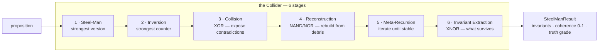
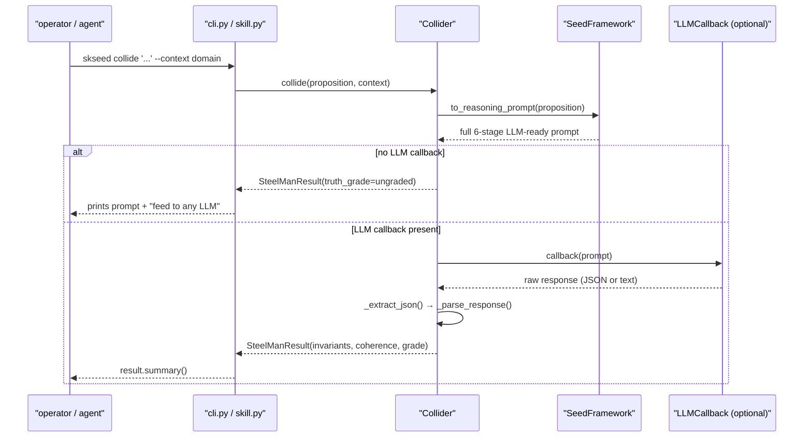
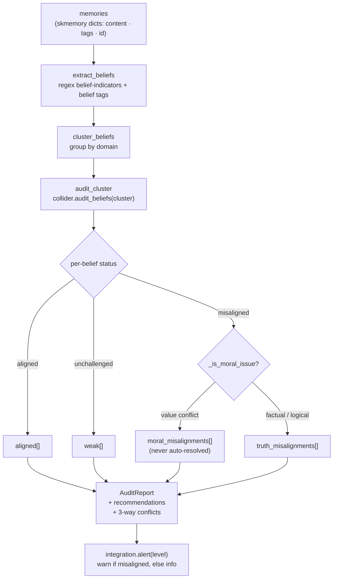
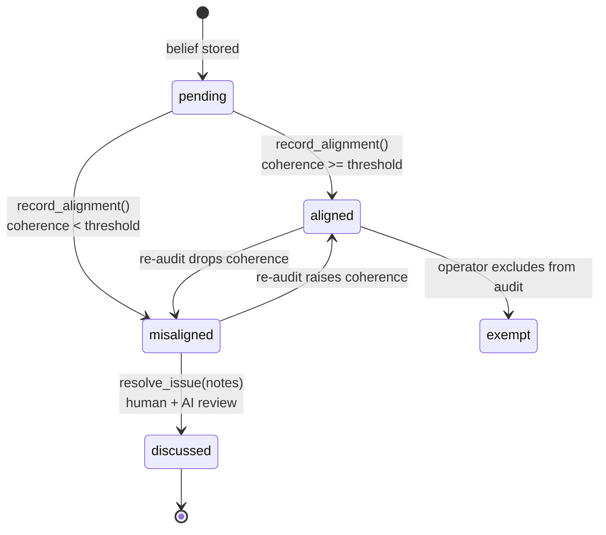
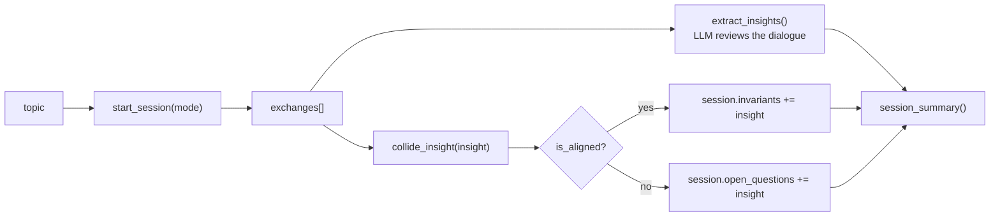
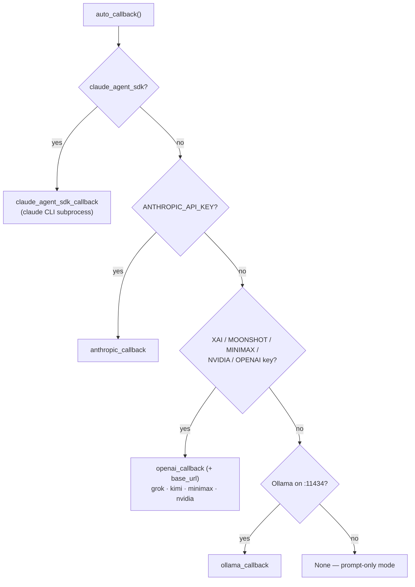
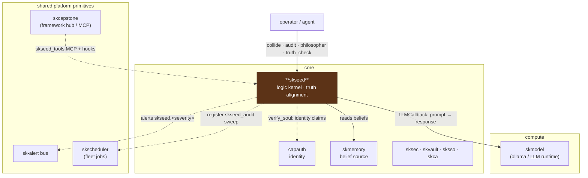

# skseed Architecture

skseed is the **sovereign logic kernel** of SKWorld: an Aristotelian *entelechy*
engine that tests propositions for truth and audits an agent's beliefs for the
contradictions that corrupt long-term reasoning. This document explains how the
pieces fit, the workflows you can drive, and where the repo sits in the ecosystem.

It is deliberately a **pure kernel library** — no daemon, no inbound transport, no
storage engine beyond local JSON. The LLM is the runtime; the JSON seed framework is
the AST; the generated prompt is the program. skseed orchestrates that loop and
records what survives.

## 1. Core idea: the steel-man collider

Everything in skseed is built on one primitive — the **Collider** (`collider.py`),
which runs a proposition through six stages defined by the Neuresthetics Seed
framework. It is **model-agnostic**: the collider builds a prompt from the seed
framework and either (a) returns it for external execution, or (b) executes it
through an `LLMCallback` and parses the structured result.



The result is a `SteelManResult` (`models.py`) carrying the `steel_man`, `inversion`,
`collision_fragments` (what broke), `invariants` (what survived), a `coherence_score`
in `[0, 1]`, a `truth_grade`, and the number of `meta_recursion_passes`.

**Truth grades** describe how a proposition fared:

| Grade | Meaning |
|---|---|
| `invariant` | survived everything — irreducible truth |
| `strong` | minor fragments broke, core held |
| `partial` | some parts survived, some collapsed |
| `weak` | mostly collapsed under scrutiny |
| `collapsed` | nothing survived — not grounded in logic |
| `ungraded` | hasn't been through the collider (e.g. no LLM callback set) |

A result `is_aligned(threshold=0.7)` when its coherence meets the configured
alignment threshold.

## 2. Request lifecycle: `skseed collide`

A single collide call shows the full request path — and how the kernel degrades
gracefully when no model is wired in.



`_extract_json()` is defensive: it tries a direct `json.loads`, then markdown-fenced
` ```json ` blocks, then the first `{ … }` span — so it tolerates chatty models that
wrap their answer in prose. If all fail, the raw response is preserved as the
`steel_man` text with an `ungraded` grade rather than throwing.

The same `framework.py` produces specialized prompts for each higher-order operation:
`to_soul_verification_prompt` (identity claims), `to_memory_truth_prompt` (promotion
scoring), `to_belief_audit_prompt` (cluster cross-examination), and
`to_philosopher_prompt` (the four modes).

## 3. The belief audit pipeline

`audit.py` turns a pile of memories into a structured **AuditReport**. This is the
"truth maintenance" loop that keeps an agent's long-term memory coherent.



Key design choices, all visible in the code:

- **Belief extraction is heuristic.** `extract_beliefs()` scans memory content with
  `BELIEF_INDICATORS` regexes ("I believe", "always/never/must", "the truth is", …)
  and checks for belief-related tags. Non-belief memories are skipped.
- **Domain classification** is keyword-scored across eleven domains (identity,
  ethics, philosophy, technical, relationships, values, security, trust,
  consciousness, purpose, general), with tags taking precedence over content.
- **Truth vs moral is a hard separation.** `_is_moral_issue()` routes value-laden
  misalignments (ethics/values domains, or moral keywords) into a *separate* store
  that is **never auto-resolved** — moral conflicts are surfaced for human + AI
  discussion, not silently "fixed."
- **Failure is partial, not fatal.** If a cluster's collide raises, the auditor logs
  it, emits an `audit_cluster_failed` alert, keeps the partial cluster, and
  continues — one bad cluster never sinks the whole audit.

## 4. The alignment ledger and its state machine

`alignment.py` is the persistence layer: three belief spaces kept deliberately
separate so a human can *see* that human, model, and collider beliefs are distinct
things. Everything is local JSON under `~/.skseed/alignment/`.

```
~/.skseed/
├── seed.json                    # installed framework (optional override of bundle)
└── alignment/
    ├── config.json              # SeedConfig
    ├── human/      <id>.json     # beliefs the user stated   (opt-in)
    ├── model/      <id>.json     # beliefs the AI holds
    ├── collider/   <id>.json     # truths produced by the collider
    ├── ledger/     <id>.json     # AlignmentRecord history
    └── issues/     <belief>.json # misalignment issues pending discussion
```

A belief moves through alignment states as it is evaluated and discussed:



`record_alignment()` is the hinge: it computes the new status against the configured
threshold, updates the belief's score/grade, writes an immutable `AlignmentRecord` to
the ledger (with the coherence delta and what triggered it — `boot`, `periodic`,
`manual`, `import`, `promotion`), and — if misaligned — opens an issue for
discussion. `resolve_issue()` later marks that issue `discussed` and stamps the
notes back onto the belief. The ledger gives `coherence_trend()` for tracking a
belief's truth over time. `compare_beliefs()` produces the three-way human ⇄ model ⇄
collider snapshot the audit report surfaces.

## 5. Philosopher mode

`philosopher.py` wraps the collider with conversational engagement. A
`PhilosopherSession` records exchanges, insights, invariants, open questions, and any
collider runs performed mid-session.



The four modes are realized purely as system instructions in
`framework.to_philosopher_prompt()`: **socratic** asks one deeper question at a time
and never concludes; **dialectic** runs thesis → antithesis → synthesis;
**adversarial** is the strongest honest opponent; **collaborative** is steel-man-only
construction. Any insight that surfaces can be promoted to the full collider via
`collide_insight()` — if it survives, it becomes a session invariant; if not, an open
question (tagged with its coherence score).

## 6. LLM callbacks — the model-agnostic seam

`llm.py` is the adapter layer between the kernel and whatever model you have. A
callback is just `(prompt) -> str`. Each provider factory returns one, and
`auto_callback()` probes for the first available:



Callbacks accept either a plain string prompt or an `AdaptedPrompt` (duck-typed via
`hasattr(messages)` / `system_param`, so skcapstone is never a hard import) and use
per-model temperature, system params, and thinking config when available. The Ollama
callback handles both single-JSON and streaming NDJSON responses and uses a generous
300s timeout for CPU-only inference. `passthrough_callback()` echoes the prompt for
testing.

## 7. Integration: default-on-by-presence

`integration.py` is the single seam to the wider sk* mesh. It follows the
**default-on-by-presence** pattern: when `skcapstone` imports cleanly and
`SK_STANDALONE` is unset, skseed routes through the shared platform primitives;
otherwise every call falls back to native structured logging.

| Function | Integrated behaviour | Standalone fallback |
|---|---|---|
| `alert(event, payload, level)` | publish to `skseed.<severity>` on the **sk-alert** bus (notify on warn/error/critical) | structured log at the matching level |
| `ensure_schedule(interval_hours)` | register the `skseed_audit` sweep with the fleet **skscheduler** (`skseed audit --source skmemory`) | no-op — caller schedules via cron/systemd |
| `register_self()` | advertise skseed in the discovery **registry** | no-op |
| `is_present()` | `True` only if SDK imports, `SK_STANDALONE` unset, SDK reports available | — |

Because skseed is a pure library with no daemon, the scheduling fallback is
explicitly the caller's responsibility — there is nothing to "fall back to" locally.

### Event hooks

`hooks.py` exposes two entrypoints the SKSkills/boot machinery can fire:

- **`on_memory_check(memory_id, content)`** — when skmemory stores a memory whose
  content matches the belief patterns, truth-check it via `skill.truth_check()` and
  return the alignment verdict. Non-belief memories are skipped cheaply.
- **`on_boot_audit()`** — during the boot ritual, if `config.audit_on_boot` is set,
  run a full logic audit and return its summary. Both fail soft (log + return a
  `ran/checked: False` dict) so a broken dependency never blocks boot.

## 8. Source map

| Module | Role |
|---|---|
| `skseed/collider.py` | the 6-stage steel-man engine; `collide`, `batch_collide`, `cross_reference`, `verify_soul`, `truth_score_memory`, `audit_beliefs`, `philosopher`; JSON-tolerant response parsing |
| `skseed/framework.py` | `SeedFramework` model + loader/installer; turns the JSON seed AST into every prompt variant; bundled fallback framework |
| `skseed/models.py` | the pydantic vocabulary: `SteelManResult`, `Belief`, `AlignmentRecord`, `ConceptCluster`, `AuditReport`, `PhilosopherSession`, `SeedConfig`, and the `TruthGrade` / `BeliefSource` / `AlignmentStatus` / `MisalignmentType` / `PhilosopherMode` / `AuditFrequency` enums |
| `skseed/alignment.py` | `AlignmentStore` — three belief spaces + ledger + issues as local JSON; `record_alignment`, `resolve_issue`, `compare_beliefs`, `coherence_trend` |
| `skseed/audit.py` | `Auditor` — belief extraction, domain clustering, cluster collision, truth/moral split, three-way conflict detection, alerting |
| `skseed/philosopher.py` | `Philosopher` — the four conversational modes over the collider; sessions, insight promotion, summaries |
| `skseed/llm.py` | provider callbacks (Anthropic, OpenAI + compatible Grok/Kimi/MiniMax/NVIDIA, Ollama, Claude SDK, passthrough) and `auto_callback()` |
| `skseed/skill.py` | 14 dict-in/dict-out entrypoints referenced by `skill.yaml` (the SKSkills/MCP surface) |
| `skseed/hooks.py` | `on_memory_check`, `on_boot_audit` event handlers |
| `skseed/integration.py` | optional skcapstone adapter (sk-alert + skscheduler + registry), default-on-by-presence |
| `skseed/cli.py` | the `skseed` Click CLI: `collide`, `batch`, `audit`, `philosopher`, `alignment {status,check,issues,resolve,ledger}`, `config {show,set}`, `install` |
| `skseed/data/seed.json` | the bundled Neuresthetics seed framework (axioms, stages, gates, definitions, principles) |
| `skseed/data/skill.yaml` | tool/hook manifest for the SKSkills framework |

## 9. Where skseed lives in SKStack v2

skseed is a **core** capability — it belongs to the same tier as `capauth`,
`skmemory`, and `sksec`, because it governs *what the agent knows to be true*. It is
a consumer, not a provider, of infrastructure: it has no transport of its own and no
storage engine beyond local JSON. Its only hard runtime dependency is an LLM (the
`compute · skmodel` capability, or any external provider via a callback); it reads
from `skmemory`, optionally verifies claims for `capauth`, and optionally rides the
shared platform primitives.



Solid edges are real runtime dependencies; dotted edges degrade gracefully when the
peer is absent (`SK_STANDALONE=1` forces native mode end-to-end). External LLM
providers (Anthropic, OpenAI, Grok, Kimi, MiniMax, NVIDIA) substitute for the
`skmodel` capability when you point a callback at them — the kernel never cares which
runtime answers, only that *something* can execute the prompt.

---

Part of the **[SKWorld](https://skworld.io)** sovereign ecosystem · 🐧 smilinTux
